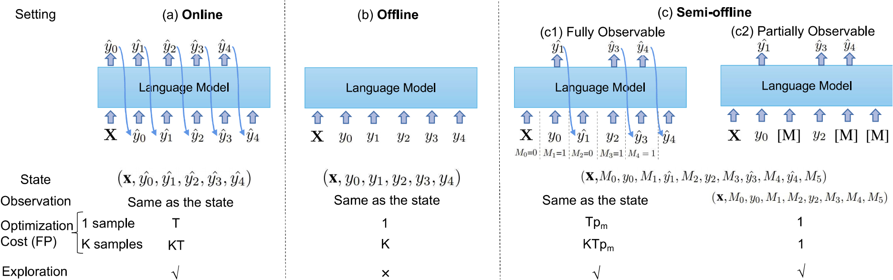

# Semi-Offline Reinforcement Learning for Optimized Text Generation

This repository contains the code, data, and checkpoints for our paper published in ICML2023:<br>
**Semi-Offline Reinforcement Learning for Optimized Text Generation**<br>
*Changyu Chen, Xiting Wang, Yiqiao Jin, Victor Ye Dong, Li Dong, Jie Cao, Yi Liu, Rui Yan* <br>
Paper: http://arxiv.org/abs/2306.09712 <br>


```bibtex
    @article{chen2023semi,
      title={Semi-Offline Reinforcement Learning for Optimized Text Generation},
      author={Chen, Changyu and Wang, Xiting and Jin, Yiqiao and Dong, Victor Ye and Dong, Li and Cao, Jie and Liu, Yi and Yan, Rui},
      journal={arXiv preprint arXiv:2306.09712},
      year={2023}
    }
```


### 1. Overview

Our semi-offline method is illustrated in (c2): we use static data as the starting point and do exploration by one Forward Propagation (FP).

<div  align="center">
 
</div>

### 2. Install
```console
git clone https://github.com/ChangyuChen347/semi-offline-RL
cd semi-offline-RL
pip install -r requirement.txt
```

### 3. Train
You can simply run the bash scripts under the **train** directory. Before training, you should download the data and checkpoint of base model.

```console
bash train/run_cnn.sh
```
or
```bash
CUDA_VISIBLE_DEVICES=0 python main.py \
    --do_train \
    --scene bart_cnn_generation \
    --use_logit True \
    --report_to tensorboard \
    --seed 2022 \
    --smooth 0.1 \
    --trainer rl \
    --save_steps 10000000 \
    --learning_rate 0.000001 \
    --num_train_epochs 60 \
    --max_grad_norm 1 \
    --print_every 1000 \
    --save_every 4000 \
    --eval_steps 2000 \
    --per_device_train_batch_size 1 \
    --gradient_accumulation_steps 8 \
    --per_device_eval_batch_size 16 \
    --length_normalize_4_rl True \
    --train_dir sample/cnndm_train.tsv \
    --eval_dir sample/cnndm_test.tsv \
    --cand_pos_remove_sp_tk True \
    --recover cnndm_base_model \
    --exp_name demo_cnndm \
    --rewards 'rouge' \
    --rouge_type 12l \
    --rl_weight 20 \
    --sample_num 63 \
    --mask_rate 0.4 \ 
    --kd_inputs_worst True \
    --eval_metrics rouges \ 
```


Training Parameters:

Basic setting:
- `--learning_rate`: Sets the learning rate for training.
- `--num_train_epochs`: Specifies the number of training epochs.
- `--max_grad_norm`: Sets the maximum gradient norm for gradient clipping.
- `--print_every`: Prints training progress every specified number of steps.
- `--save_every`: Saves the model every specified number of steps.
- `--eval_steps`: Evaluates the model every specified number of steps.
- `--per_device_train_batch_size`: Sets the training batch size per GPU.
- `--gradient_accumulation_steps`: Accumulates gradients over the specified number of steps.
- `--per_device_eval_batch_size`: Sets the evaluation batch size per GPU.
- `--length_normalize_4_rl`: Applies length normalization for reinforcement learning.
- `--cand_pos_remove_sp_tk`: Removes special tokens (pad/eos) from the candidate positions.
- `--exp_name`: Specifies the experiment name.
- `--eval_metrics`: Specifies the evaluation metric.

Model and Task:
- `--scene`: Specifies the scene or task for the model. The config file is in ./config/SceneConfigs/ 
- `--train_dir`: Specifies the training dataset directory.
- `--eval_dir`: Specifies the evaluation dataset directory.
- `--recover`: Recovers the base model.

RL setting:
- `--rewards`: Specifies the reward metric.
- `--rouge_type`: Sets the Rouge metric type (12l for rouge-1, rouge-2, and rouge-L).
- `--rl_weight`: Sets the weight for reinforcement learning loss.
- `--sample_num`: Sets the number of samples for RL.
- `--mask_rate`: Sets the masking rate for both sft and RL.
- `--kd_inputs_worst`: Uses worst case inputs for knowledge distillation.


### 4. Evaluation
You can simply run the bash scripts under the **evaluation** directory.

The evaluation (word tokenization and metric computation) of CNN/DM 
and XSum is following [BRIO](https://github.com/yixinL7/BRIO): The predictions 
are first lowercased and tokenized using the PTB tokenizer provided 
by Standford 
([download here](https://repo1.maven.org/maven2/edu/stanford/nlp/stanford-corenlp/3.8.0/stanford-corenlp-3.8.0.jar)), 
and then the ROUGE score is computed using the standard ROUGE Perl package
from ([download here](https://github.com/summanlp/evaluation/tree/master/ROUGE-RELEASE-1.5.5)).

After downloading the two files, you can set the environment variables using the following commands:

```bash
export _ROUGE_PATH=./ROUGE-RELEASE-1.5.5
export CLASSPATH=./stanford-corenlp-3.8.0.jar
```

To utilize the ROUGE Perl package, you may need to install XML::DOM and XML::Parser. Alternatively, you can use the "-p" flag to obtain Python results for a quick start. Please note that the Python results may have slight differences compared to the Perl results.


#### Example: The script for evaluating CNN/DM is as follows:

```console
bash evaluation/eval_cnn.sh
```
or
```console
exp_name=rl
output_dir_path=eval_output
model_dir_path=model_output
dataset=cnndm
export _ROUGE_PATH=./ROUGE-RELEASE-1.5.5
export CLASSPATH=./stanford-corenlp-3.8.0.jar
bash evaluation/run_test_cnndm.sh ${exp_name} ${output_dir_path} ${model_dir_path}
python extract_prediction.py --dataset ${dataset} --exp_name ${exp_name} --output_dir_path ${output_dir_path}
cat ${output_dir_path}/${dataset}/${exp_name}/pred.txt | java edu.stanford.nlp.process.PTBTokenizer -ioFileList -preserveLines > ${output_dir_path}/${dataset}/${exp_name}/pred.txt.token
cat ${output_dir_path}/${dataset}/${exp_name}/ref.txt | java edu.stanford.nlp.process.PTBTokenizer -ioFileList -preserveLines > ${output_dir_path}/${dataset}/${exp_name}/ref.txt.token
python cal_rouge.py --ref  ${output_dir_path}/${dataset}/${exp_name}/ref.txt.token --hyp ${output_dir_path}/${dataset}/${exp_name}/pred.txt.token
```


### 5. Checkpoints and static datasets


The base models are supervised fine tuning (SFT) model trained with [mask] token. The rl models are our trained checkpoints.

|        | BASE (M-FT)                 | RL                        | 
|--------|-----------------------------|---------------------------|
| CNN/DM | [cnndm_bart_base_model](https://drive.google.com/file/d/1Dex_Jp-iOo_W_Pu703AVQT5JcvC-vFUs/view?usp=drive_link)   | [cnndm_bart_rl_model](https://drive.google.com/file/d/1XURmS-nl076nyz4FZ3IJAEsPrKw6ItBW/view?usp=drive_link)   | 
| SAMSum | [samsum_bart_base_model](https://drive.google.com/file/d/1DCfGyCgKszfG_sFfUwQRvayP7k5bmlpQ/view?usp=drive_link)  | [samsum_bart_rl_model](https://drive.google.com/file/d/1VS5anBYqhc-CCgRKeH_rIHCSA4pVUyo_/view?usp=drive_link)  |  
| SQuAD  | [t5_squad_base_model](https://drive.google.com/file/d/13j8k_DnOx5iJDKYBKRZyDNBOM_ONQq5i/view?usp=drive_link)     | [t5_squad_rl_model](https://drive.google.com/file/d/1n_WvY0QMP6lx9YDfs0cvboPmkZds9BKJ/view?usp=drive_link)     |   
| XSum   | [xsum_pegasus_base_model](https://drive.google.com/file/d/12-ZplOOdTCMoGUnUBAwJ1pe68UKIzm6X/view?usp=drive_link) | [xsum_pegasus_rl_model](https://drive.google.com/file/d/1H0dM4zBhzlYTdZ9Yx4jvgbT2v2XNnvy8/view?usp=drive_link) |  

The training datasets (*_train.tsv) comprise the source, ground truth, and ordered candidates.

|        | Train                | validation                                                                                                | Test                |
|--------|----------------------|-----------------------------------------------------------------------------------------------------------|---------------------|
| CNN/DM | [cnn_train.tsv](https://drive.google.com/file/d/1E_cabdieztO9K93a8TYXTtZ2i2b6G4mw/view?usp=drive_link)    | [cnn_valid.tsv](https://drive.google.com/file/d/1La63p-Nr9JEN-Wwt-N6CtLUaNyUA3DCX/view?usp=drive_link)    | [cnn_test.tsv](https://drive.google.com/file/d/1Yo7YEjeoX3V5BNvQ97kNvJQ9jqlYBuBY/view?usp=drive_link)    |
| SAMSum | [samsum_train.tsv](https://drive.google.com/file/d/1D2uS8sWUOoheSCDU54oU0rI7Me9mrS_5/view?usp=drive_link) | [samsum_valid.tsv](https://drive.google.com/file/d/1F6va3Vc--hYssHf2dTWoDPXs-PvH9uH8/view?usp=drive_link) | [samsum_test.tsv](https://drive.google.com/file/d/1e9jNkeVs4EPm55f4ZfGfz5Z4HiyhPcMm/view?usp=drive_link) |
| SQuAD  | [squad_train.tsv](https://drive.google.com/file/d/1whlEexsi9Np6U89jnPeqQzbOjJDXb1ed/view?usp=drive_link)  | [squad_valid.tsv](https://drive.google.com/file/d/1F8L2uDm0nTxv9TEz_WW_wfjJ4XSJGaZw/view?usp=drive_link)  | [squad_test.tsv](https://drive.google.com/file/d/1yMYGgHgRl8IEHN7HKw3J5AxTi_LaFkc8/view?usp=drive_link)  |
| XSum   | [xsum_train.tsv](https://drive.google.com/file/d/14yeU_bXceP4Ip01t9WCOix3M-GsTv97y/view?usp=drive_link)   | [xsum_valid.tsv](https://drive.google.com/file/d/1RtsWzFLScFgUlxdcQ4f84H52cYU_rMcX/view?usp=drive_link)   | [xsum_test.tsv](https://drive.google.com/file/d/1keYXGtpJ_ymtsQlTvui6wOhcEtlkmQ0P/view?usp=drive_link)   |

